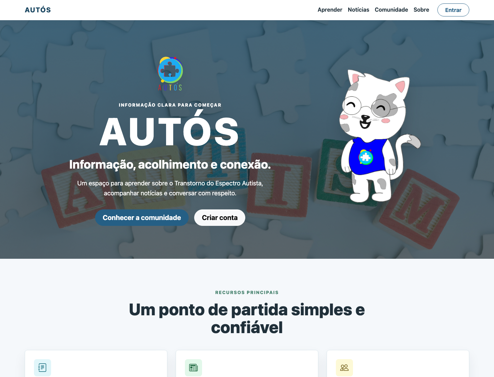
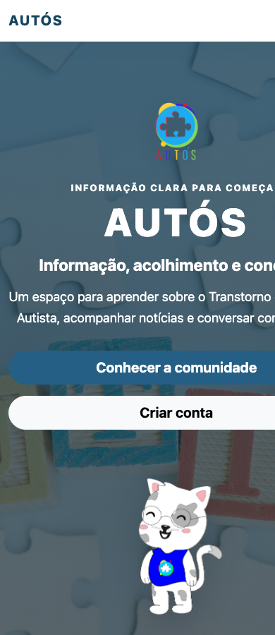
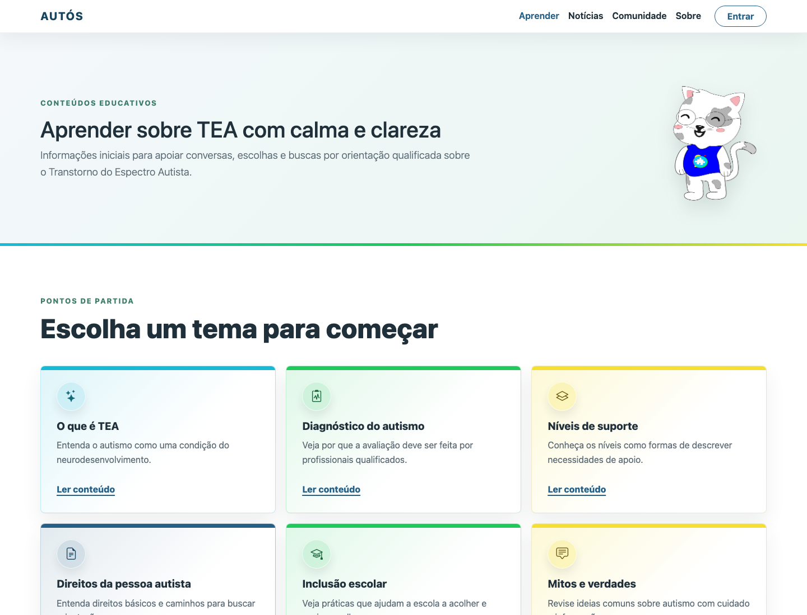
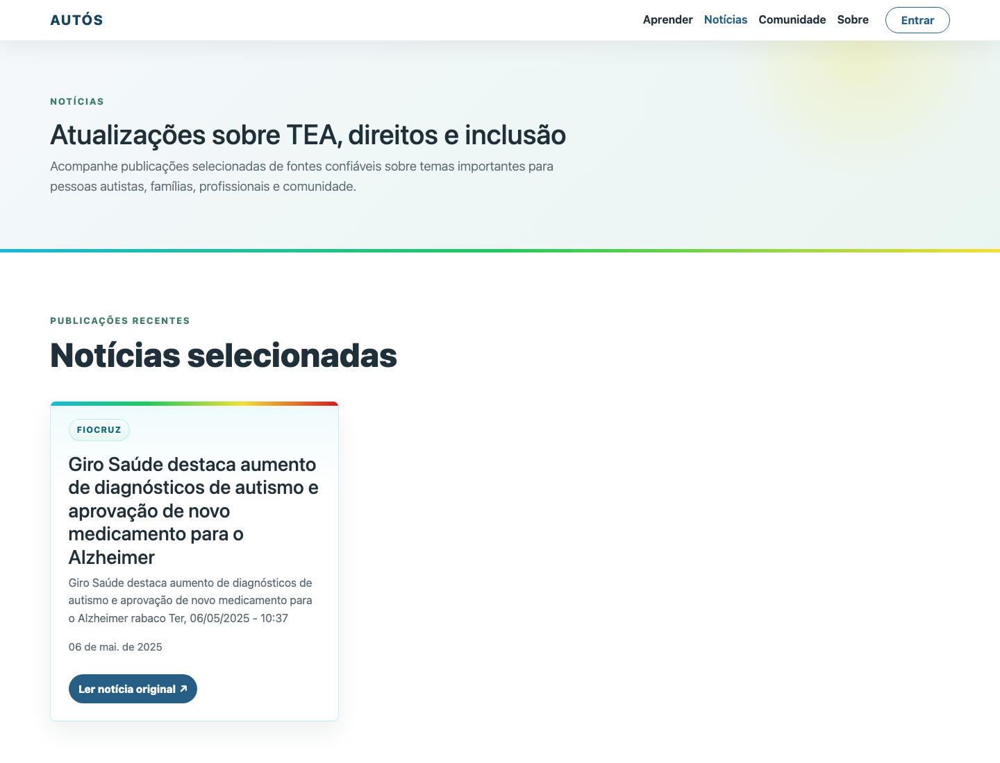
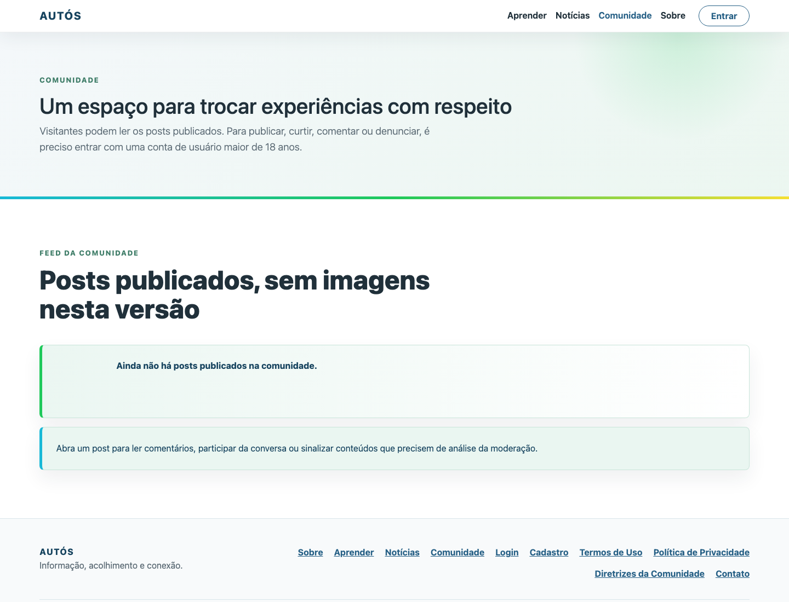
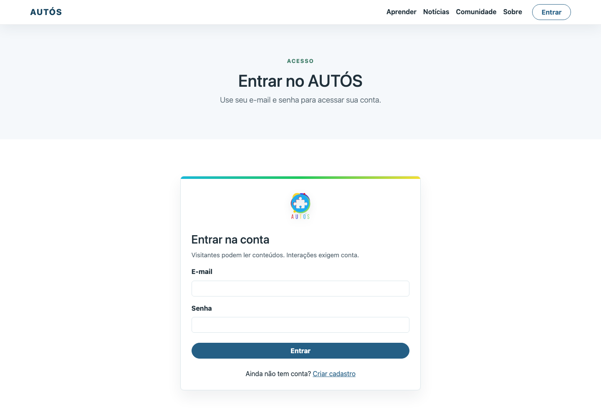
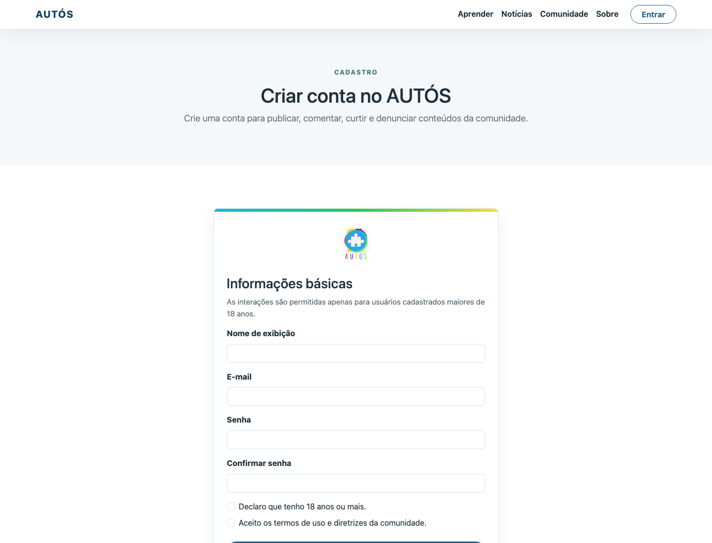
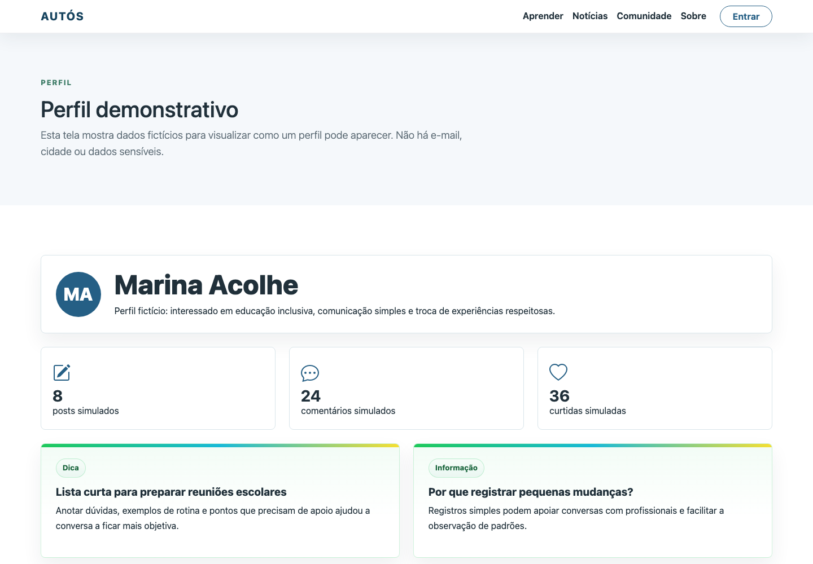
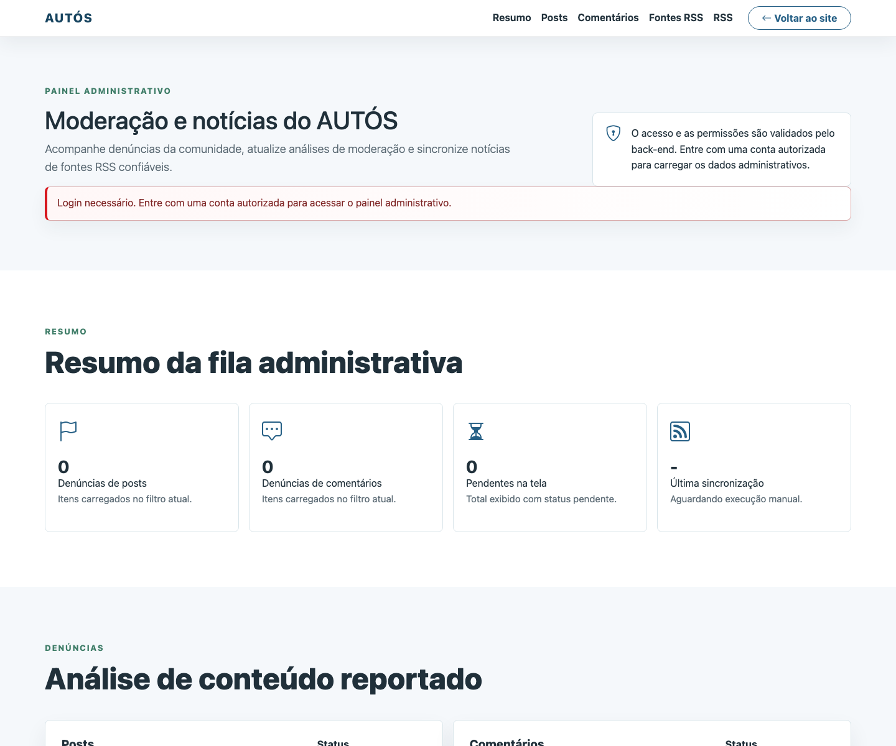
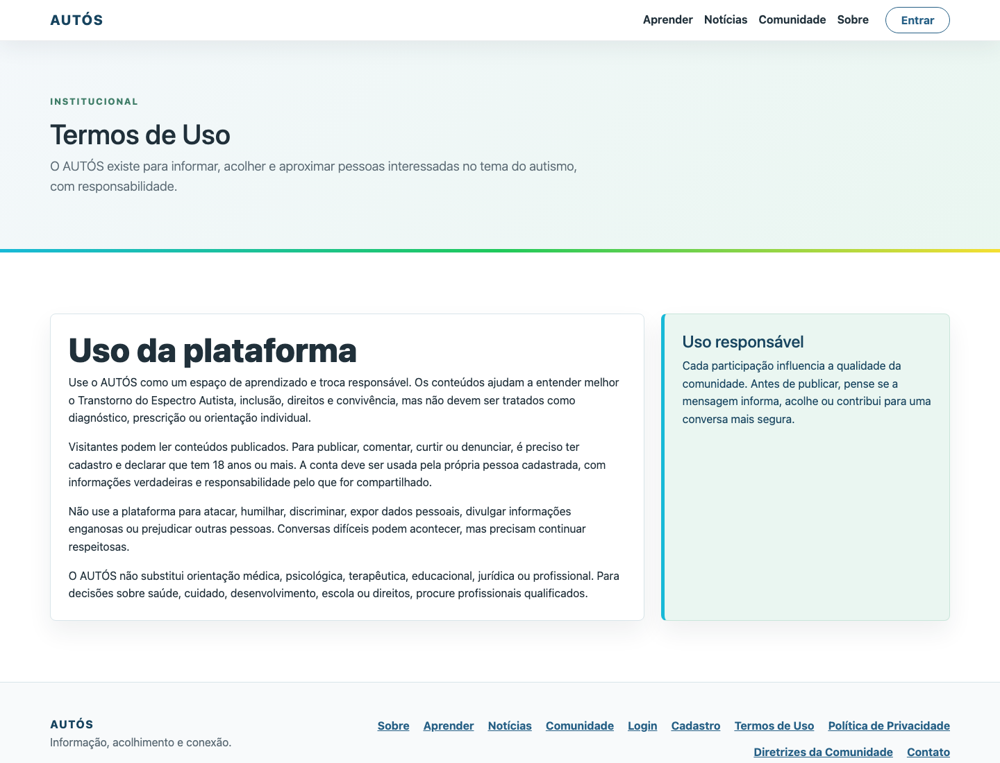

# AUTÓS

AUTÓS é uma aplicação web educativa sobre autismo/TEA, criada como projeto de portfólio para reunir páginas informativas, conteúdos educativos, notícias, comunidade e recursos de moderação em uma experiência responsiva.

Deploy: https://autos-591j.onrender.com/

## Stack

- HTML
- CSS
- JavaScript
- Bootstrap 5
- Node.js
- Express
- MySQL
- Render
- Aiven

## Screenshots

### Home Desktop



### Home Mobile



### Aprender



### Notícias



### Comunidade



### Login



### Cadastro



### Perfil



### Admin



### Termos



## Funcionalidades

- Páginas públicas com informações institucionais e orientações gerais.
- Conteúdos educativos sobre TEA, inclusão, direitos e apoio.
- Notícias via RSS com curadoria temática.
- Cadastro e login de usuários.
- Sessão com cookie HttpOnly.
- Comunidade com posts, comentários e curtidas.
- Fluxo de denúncias para posts e comentários.
- Painel administrativo para moderação e gestão de notícias.
- PWA com manifest e service worker.
- Layout responsivo para desktop e dispositivos móveis.

## Segurança

- Senhas protegidas com hash no backend.
- Sessões armazenadas no servidor.
- Cookie de sessão HttpOnly.
- Configuração por variáveis de ambiente.
- Filtro de palavras no backend.
- Rotas protegidas para ações autenticadas e administrativas.
- Arquivos `.env` fora do versionamento.

## Arquitetura

O projeto combina um front-end estático com uma API REST em Node.js/Express. O banco de dados é MySQL, com scripts SQL versionados para criação da estrutura e carga inicial. O deploy público roda na Render, com banco MySQL gerenciado na Aiven.

```text
Navegador
  -> Front-end estático
  -> API REST Express
  -> MySQL Aiven
```

## Como Rodar Localmente

1. Clone o repositório:

```bash
git clone https://github.com/theusbiel739/Autos.git
cd Autos
```

2. Instale as dependências do backend:

```bash
cd backend
npm install
```

3. Configure o ambiente:

```bash
cp .env.example .env
```

Edite `backend/.env` com base no `backend/.env.example`, informando os dados do MySQL e demais variáveis necessárias.

4. Importe o banco de dados:

```bash
mysql -u root -p autos_db < ../database/schema.sql
mysql -u root -p autos_db < ../database/seeds.sql
```

5. Inicie o backend:

```bash
npm start
```

Por padrão, a API roda em `http://localhost:3001/api`. O front-end pode ser aberto localmente por um servidor estático, como Live Server.

## Estrutura do Projeto

```text
.
├── assets/              # CSS, JavaScript, imagens de marca e recursos estáticos
├── backend/             # API REST com Node.js, Express e MySQL
├── database/            # Schema e seeds do banco de dados
├── docs/screenshots/    # Capturas usadas no README
├── images/              # Imagens estáticas do site
├── *.html               # Páginas públicas e telas da aplicação
├── manifest.json        # Manifest PWA
├── service-worker.js    # Cache estático da aplicação
└── README.md
```

## Roadmap

- Melhorias de acessibilidade.
- Ajustes de SEO para páginas públicas.
- Otimizações de performance e carregamento.
- Evolução das ferramentas de moderação.
- Preparação de uma versão 1.0.

## Aviso

O AUTÓS é um projeto educativo e de portfólio. As informações apresentadas não substituem avaliação, diagnóstico, acompanhamento ou orientação profissional.

## Autor

Matheus Silva

GitHub: https://github.com/theusbiel739

## Licença e Créditos

O arquivo `LICENSE.txt` permanece no projeto para preservar créditos e licença do template original enquanto houver base herdada.
